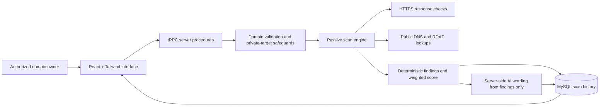

# CyberShield SME

> **CyberShield SME** is a responsive cybersecurity posture-assessment web application for small and medium businesses. It turns authorized, passive observations of a public domain into a transparent A–F score, an evidence-led report, and practical remediation guidance in plain English.

CyberShield is deliberately **not** a penetration-testing tool. It does not attempt exploitation, port scanning, credential testing, brute force, application crawling, or bypassing controls. Assess only domains you own or for which you have explicit written authorization.

## Product overview

The application gives domain owners a fast, understandable snapshot of three areas: website security, email security, and public domain intelligence. A user signs in, confirms authorization, submits a public domain, and receives a saved report containing observed evidence, severity, business impact, recommended remediation, transparent category scores, and an overall grade.

| Capability | What CyberShield does |
|---|---|
| **Website surface** | Requests the public HTTPS home page without following redirects, then observes HTTPS availability, TLS protocol and expiry context, selected response headers, cookie attributes, `robots.txt` visibility, and a content-free public `.git/HEAD` posture check. |
| **Email posture** | Passively reads public DNS records for SPF, DMARC, and MX routing context. When the owner provides a DKIM selector, it also performs a selector-specific public DKIM lookup. |
| **Domain intelligence** | Collects public A/AAAA records, nameservers, RDAP registrar and registration-age context, plus bounded public certificate-transparency subdomain context when available. |
| **Scoring** | Calculates all grades from deterministic findings using a visible category weight and risk-point method. |
| **Plain-English guidance** | Uses the server-side AI layer only to explain the already-recorded findings; it does not independently verify vulnerabilities. |
| **Private workspace** | Saves reports against the signed-in user and returns only that user’s own scan history. |
| **Printable output** | Provides a professional report route with a print stylesheet; the browser’s print dialog can save it as a PDF. |

## Comparison and live scan feedback

CyberShield compares a completed assessment only with the **immediately previous saved assessment of the same normalized domain belonging to the same signed-in user**. It never compares one user’s result with another user’s data. The dashboard presents overall movement alongside concise website, email, and domain score changes; the detailed report includes the complete category delta panel and a baseline state when there is no earlier same-domain result.

Scan feedback is delivered through an authenticated server event stream rather than a client-side timer. The interface reports each actual high-level operation as it begins: public-domain validation, DNS review, HTTPS and TLS review, `robots.txt` visibility, public metadata posture, RDAP and certificate-transparency context, deterministic scoring, AI-assisted wording, and report persistence. An unauthenticated request is rejected before any external request can start. A completed scan briefly shows a completion state before opening the saved evidence ledger.

## Architecture



The client communicates through tRPC procedures. On the server, the scan engine first validates and normalizes the submitted domain, confirms that it does not resolve to a private or reserved network address, then performs bounded HTTP and DNS lookups. The score is calculated before the AI step. The AI receives only a compact JSON representation of the already-created deterministic findings and is instructed not to add new findings or assert that a vulnerability is proven.

## Safety model and assessment boundaries

CyberShield enforces a permission-first passive-assessment model.

| Included | Explicitly excluded |
|---|---|
| Public DNS lookups for A, AAAA, MX, SPF, DMARC, nameservers, and public RDAP data | Port scanning, banner grabbing, service enumeration, or network mapping |
| One bounded HTTPS response inspection, TLS handshake, `robots.txt` request, content-free public `.git/HEAD` status check, and public certificate-transparency lookup | Exploit attempts, vulnerability proof-of-concept execution, or application fuzzing |
| Observing selected security headers and response cookie flags | Password guessing, credential validation, brute force, or authentication bypass |
| User confirmation that they own or are authorized to assess the domain | Scanning local hosts, IP addresses, private ranges, custom ports, paths, or credential-bearing URLs |

The scan engine accepts a hostname only. It rejects URLs containing page paths, queries, fragments, credentials, custom ports, IP addresses, `localhost`, and `.local` targets. It also checks resolved A and AAAA records and rejects known private, loopback, link-local, documentation, multicast, and reserved destinations. Requests use a short timeout, identify CyberShield in the user agent, and do not automatically follow redirects. The Git metadata posture check uses `HEAD` only and never reads response content. Certificate-transparency context is limited to a small public result set.

## Transparent scoring

Every report is scored from deterministic findings. An informational or successful check does not remove points. A failed or warning finding applies a severity-based risk deduction. Warning findings use 60% of the relevant deduction; failed findings use 100%.

| Category | Overall weight | Base risk points by severity |
|---|---:|---|
| Website security | 50% | Critical: 40, High: 25, Medium: 15, Low: 5 |
| Email security | 30% | Critical: 40, High: 25, Medium: 15, Low: 5 |
| Domain intelligence | 20% | Critical: 40, High: 25, Medium: 15, Low: 5 |

For each category, CyberShield calculates `max(0, 100 − sum(risk points × check weight × finding state multiplier))`. The overall score is the weighted total of the three category scores. The letter grade is calculated consistently from the resulting numeric score.

| Numeric score | Grade |
|---:|:---:|
| 90–100 | A |
| 80–89 | B |
| 70–79 | C |
| 55–69 | D |
| 0–54 | F |

This grade is a prioritization aid, not a guarantee that the assessed domain is secure or that no other issues exist.

## Technology stack

| Layer | Technology |
|---|---|
| Frontend | React 19, TypeScript, Tailwind CSS, shadcn/ui, Wouter |
| Backend | Node.js, Express, tRPC |
| Authentication | Manus OAuth, with protected tRPC procedures |
| Database | MySQL/TiDB through Drizzle ORM |
| Passive checks | Native Node DNS resolver and bounded HTTPS `fetch` requests |
| AI remediation | Server-side built-in LLM helper with strict JSON output |
| Visualizations | Recharts renders a private latest-domain score trend from the user’s saved scan history |

## Project structure

```text
client/
  src/pages/          Landing page, personal dashboard, and report view
  src/components/     Shared layout and UI components
server/
  securityScan.ts     Validation, passive DNS/HTTPS checks, and scoring
  aiRemediation.ts    Server-only finding-to-guidance transformation
  routers.ts          Protected tRPC scan procedures
  db.ts               User-scoped scan persistence helpers
drizzle/
  schema.ts           User and scan-history schema
shared/
  cybershield.ts      Shared scan, finding, score, and report types
```

## Local development

### Prerequisites

Use a current Node.js release and pnpm. The hosted project environment supplies authentication, database, storage, and AI integration variables automatically. Do not commit a `.env` file or expose keys in the browser.

### Install and run

```bash
pnpm install
pnpm dev
```

Open the development URL printed by the server. Sign in before launching an assessment because scan history is stored against the authenticated account.

### Database migration

The repository includes the `scans` table migration under `drizzle/`. In a compatible environment with `DATABASE_URL` configured, generate new migration files after schema changes and apply them through the project’s database migration workflow.

```bash
pnpm drizzle-kit generate
pnpm db:push
```

Avoid destructive schema changes in production. The scan report JSON is retained with the summary scores so the detailed report can be rendered exactly from a user’s saved history.

## Environment variables

The full-stack template provides the following values in the managed runtime. They must remain server-side unless explicitly marked as `VITE_` client configuration.

| Variable | Purpose |
|---|---|
| `DATABASE_URL` | Database connection for users and scan summaries. |
| `JWT_SECRET` | Session security. |
| `OAUTH_SERVER_URL`, `VITE_OAUTH_PORTAL_URL`, `VITE_APP_ID` | OAuth sign-in flow. |
| `BUILT_IN_FORGE_API_URL`, `BUILT_IN_FORGE_API_KEY` | Server-only AI gateway used for plain-English remediation. |
| `VITE_FRONTEND_FORGE_API_URL`, `VITE_FRONTEND_FORGE_API_KEY` | Platform-managed client integration configuration. |

The project intentionally does not require a third-party scanner API key. External DNS and RDAP sources are public lookups and can sometimes be unavailable or rate-limited; CyberShield records an informational unavailable-check result instead of pretending that a missing lookup proves an issue.

## Testing

Run static checks and the test suite before creating a release checkpoint.

```bash
pnpm check
pnpm test
```

The tests currently cover domain normalization, rejected local/IP/path targets, deterministic explanation provenance, and the risk-point scoring calculation. When extending the assessment engine, add tests for each new check and make sure any AI output remains constrained to finding identifiers that already exist in the deterministic report.

## Demonstration flow

For a project demonstration, sign in and use a public domain you own or are authorized to assess. Confirm authorization, begin the passive assessment, show the scan-progress interface, open the resulting category scores and findings, expand an evidence row, point out the AI disclaimer, open the private history dashboard, then use **Print / Save PDF** from a completed report.

## Limitations and future work

CyberShield provides a limited, point-in-time posture snapshot. HTTPS header and cookie observations come from the fetched response and may differ across application routes, authenticated pages, or devices. DNS and RDAP availability depend on external services. The tool does not replace a manual security review, threat model, vulnerability assessment, or penetration test.

Potential future extensions include user-scheduled rescans with permission reconfirmation, compliance mapping, notification workflows, and additional owner-controlled mail-provider context. Any expansion must preserve the passive-only boundary and user authorization requirement.
